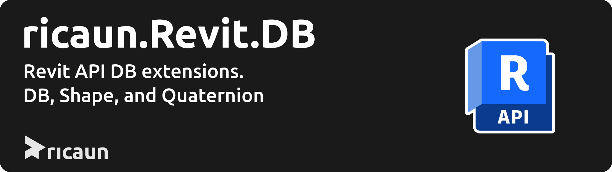

# ricaun.Revit.DB

Package with some libraries for Revit API like [Quaternion](ricaun.Revit.DB.Quaternion) and [Shape](ricaun.Revit.DB.Shape).

This project was generated by the [ricaun.AppLoader](https://ricaun.com/AppLoader/) Revit plugin, the test project use the [ricaun.RevitTest](https://ricaun.com/RevitTest) test framework.

## Wiki

For more information see [Wiki](https://github.com/ricaun-io/ricaun.Revit.DB/wiki).

## Release

* [Latest release](https://github.com/ricaun-io/ricaun.Revit.DB/releases/latest)

## License

This project is [licensed](LICENSE) under the [MIT Licence](https://en.wikipedia.org/wiki/MIT_License).

---

Do you like this project? Please [star this project on GitHub](https://github.com/ricaun-io/ricaun.Revit.DB/stargazers)!